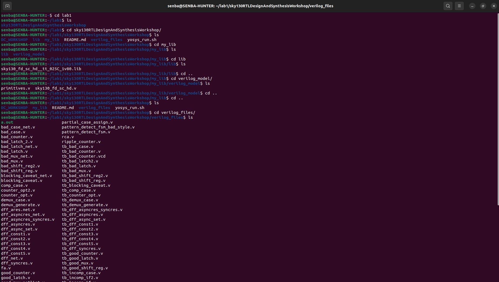

# Day 1 – Introduction to Verilog RTL Design & Simulation

Welcome to **Day 1** of the RTL Workshop!  
Today, you'll start your journey into digital design by learning **Verilog**, **open-source simulation with Icarus Verilog (iverilog)**, and **GTKWave**. This guide walks you through essential concepts, practical labs, and hands-on exercises to build a strong foundation in RTL design.

---

## Table of Contents

1. [Getting Started with Verilog Simulation](#1-getting-started-with-verilog-simulation)  
2. [Hands-On Lab: 2-to-1 Multiplexer](#2-hands-on-lab-2-to-1-multiplexer)  

---

## 1. Getting Started with Verilog Simulation

**iverilog** is an open-source Verilog simulator that allows you to compile and run your designs.  

A **testbench** is a simulation environment that applies inputs and verifies your design’s outputs.  

<div align="center">
  
  <p><i>Overview of simulator workflow</i></p>
</div>

### Setting Up Your Design

- Both the **design** and **testbench** files are compiled together.  
- The simulator produces a `.vcd` file that can be viewed in GTKWave to inspect waveforms.

<div align="center">
  
  <p><i>Compiling design and testbench in iverilog</i></p>
</div>

---

## 2. Hands-On Lab: 2-to-1 Multiplexer

In this lab, we will simulate a **2-to-1 multiplexer** using iverilog and GTKWave.

### Step 1: Clone the Workshop Repository
```bash
git clone https://github.com/kunalg123/sky130RTLDesignAndSynthesisWorkshop.git
cd sky130RTLDesignAndSynthesisWorkshop/verilog_files
