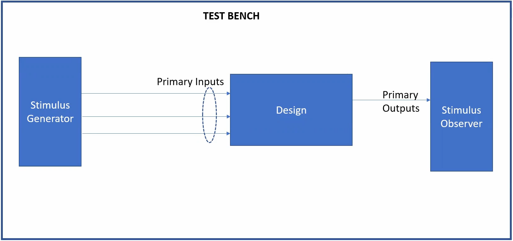
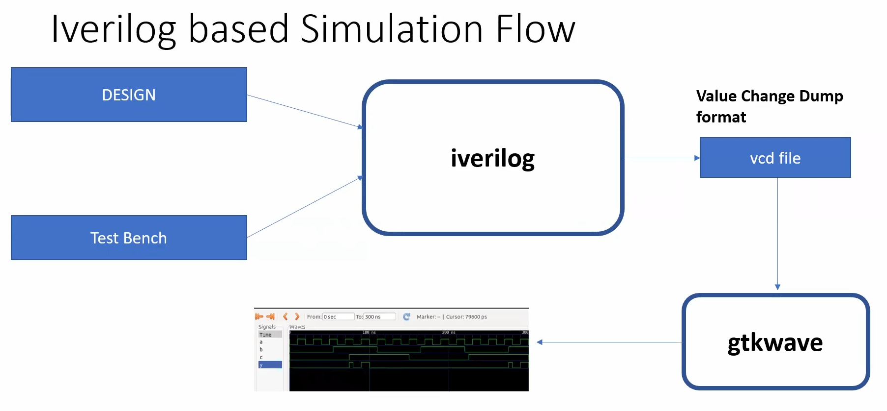
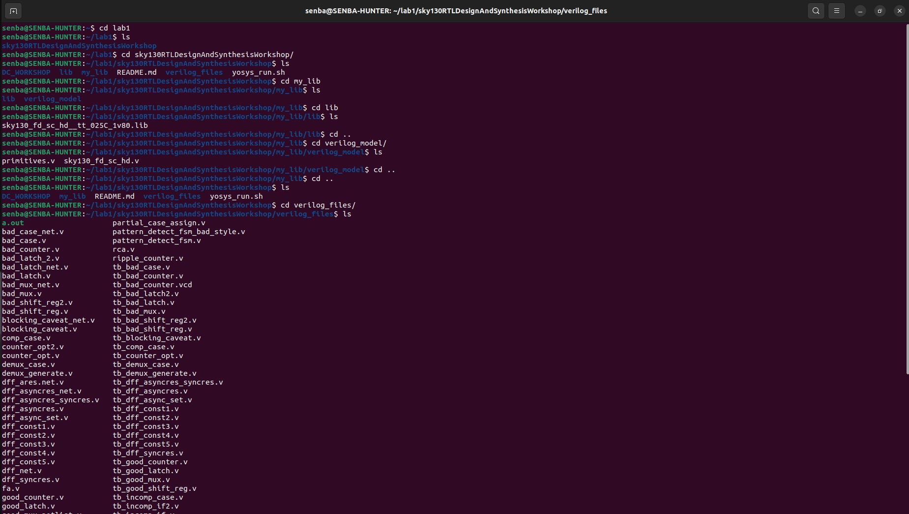

# 🛠️ Day 1 – Introduction to Verilog RTL Design & Simulation

Welcome to **Day 1** of the RTL Workshop!  
Today, you'll learn **Verilog**, open-source simulation with **Icarus Verilog (iverilog)**, and waveform analysis with **GTKWave**. This guide focuses on practical labs, essential concepts, and hands-on exercises.

---

## 📘 Table of Contents

1. [Introduction to Verilog Simulation](#1-introduction-to-verilog-simulation)  
2. [Lab: Cloning the Workshop & Setup](#2-lab-cloning-the-workshop--setup)  
3. [Lab: Iverilog Simulation & GTKWave Analysis](#3-lab-iverilog-simulation--gtkwave-analysis)  

---

## 1. Introduction to Verilog Simulation

Before writing Verilog code, it's important to understand three key components:  

### Simulator

A **simulator** is a software tool that verifies the functionality of your digital design by applying test inputs and observing outputs.

### Design

The **design** is your RTL code describing the intended logic or hardware behavior.

### Testbench (TB)

A **testbench** is an environment that applies test vectors to your design and checks the correctness of the outputs.

### Simulator Workflow

The workflow of simulation typically involves compiling the design and testbench, running the simulation, and observing the outputs.  

<div align="center">
  
  <p><i>Simulator, Design, and Testbench workflow overview</i></p>
</div>

### Iverilog Simulation Flow

**Icarus Verilog (iverilog)** compiles your design and testbench into an executable simulation. The flow includes:

1. Reading the **design** and **testbench** files  
2. Compiling to an executable  
3. Running the simulation to generate a `.vcd` waveform file  
4. Visualizing results in **GTKWave**  

<div align="center">
  
  <p><i>Simulation flow using Icarus Verilog</i></p>
</div>

---

## 2. Lab: Cloning the Workshop & Setup

First, we need to clone the repository and prepare the environment for running Verilog simulations.

### Step 1: Clone the Repository

```bash
git clone https://github.com/kunalg123/sky130RTLDesignAndSynthesisWorkshop.git
cd sky130RTLDesignAndSynthesisWorkshop/verilog_files
```
<div align="center">  <p><i>Cloning repository and exploring all lib and code files</i></p> </div>
