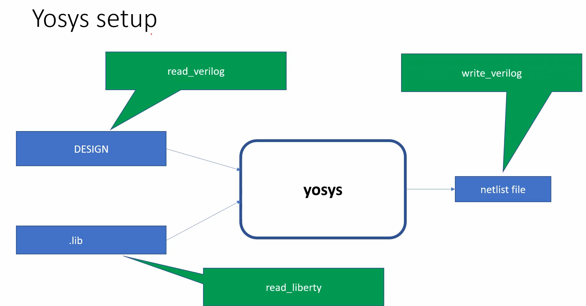

# 🛠️ Day 1 – Introduction to Verilog RTL Design & Simulation

Welcome to **Day 1** of the RTL Workshop!  
Today, you'll learn **Verilog**, open-source simulation with **Icarus Verilog (iverilog)**, and waveform analysis with **GTKWave**. This guide focuses on practical labs, essential concepts, and hands-on exercises.

---

## 📘 Table of Contents

1. [Introduction to Verilog Simulation](#1-introduction-to-verilog-simulation)  
2. [Lab: Cloning the Workshop & Setup](#2-lab-cloning-the-workshop--setup)  
3. [Lab: Iverilog Simulation & GTKWave Analysis](#3-lab-iverilog-simulation--gtkwave-analysis)  

---

## 1. Introduction to Verilog Simulation

Before writing Verilog code, it's important to understand three key components:  

### Simulator

A **simulator** is a software tool that verifies the functionality of your digital design by applying test inputs and observing outputs.

### Design

The **design** is your RTL code describing the intended logic or hardware behavior.

### Testbench (TB)

A **testbench** is an environment that applies test vectors to your design and checks the correctness of the outputs.

### Simulator Workflow

The workflow of simulation typically involves compiling the design and testbench, running the simulation, and observing the outputs.  

<div align="center">
  
  <p><i>Simulator, Design, and Testbench workflow overview</i></p>
</div>

### Iverilog Simulation Flow

**Icarus Verilog (iverilog)** compiles your design and testbench into an executable simulation. The flow includes:

1. Reading the **design** and **testbench** files  
2. Compiling to an executable  
3. Running the simulation to generate a `.vcd` waveform file  
4. Visualizing results in **GTKWave**  

<div align="center">
  
  <p><i>Simulation flow using Icarus Verilog</i></p>
</div>

---

## 2. Lab: Cloning the Workshop & Setup

First, we need to clone the repository and prepare the environment for running Verilog simulations.

### Step 1: Clone the Repository

```bash
git clone https://github.com/kunalg123/sky130RTLDesignAndSynthesisWorkshop.git
cd sky130RTLDesignAndSynthesisWorkshop/verilog_files
```
<div align="center">  <p><i>Cloning repository and exploring all lib and code files</i></p> </div>

## 3. Lab: Iverilog Simulation & GTKWave Analysis (Bad Counter)

In this lab, we simulate the **Bad Counter** design and analyze its waveform using **Icarus Verilog** and **GTKWave**.

### Step 1: Navigate to Verilog Files
```bash
cd verilog_files
```

### Step 2: Compile Design and Testbench with Iverilog
```bash
iverilog bad_counter.v tb_bad_counter.v -o a.out
```
This will create the executable a.out in the verilog_files directory.

### Step 3: Run the Simulation
```bash
./a.out
```
Running this will dump the simulation results into a .vcd file.

### Step 4: Open the VCD File in GTKWave
```bash
gtkwave tb_bad_counter.vcd
```
GTKWave will display the waveform of the Bad Counter output.

<div align="center">  <p><i>Waveform output showing the Bad Counter behavior</i></p> </div>
```

---

## 4. Introduction to Yosys and Logic Synthesis

### 🛠️ What is a Synthesizer?
A **synthesizer** is a tool that translates your high-level **RTL design** (Verilog code) into a **gate-level netlist** using a standard cell library.  
It ensures that your design can be mapped to actual hardware cells, optimizing for **area, power, and timing**.

<div align="center">
  
  <p><i>How Yosys generates the gate-level netlist</i></p>
</div>

---

## 5. Verifying the Synthesis

Once synthesis is complete, we need to **verify** whether the netlist behaves the same as the RTL design.  
The flow is:

1. Use the **netlist** and **testbench** as inputs.  
2. Run the simulation with **iverilog**.  
3. Dump the results into a **VCD file**.  
4. Open in **GTKWave** to check functional correctness.  

<div align="center">
  
  <p><i>Verification flow: Netlist + Testbench → Icarus Verilog → VCD → GTKWave</i></p>
</div>

---

## 6. Logic Synthesis Explained

Logic synthesis bridges the gap between **RTL design** and **physical logic gates**.

- **RTL Design** → Written in Verilog  
- **Frontend Libraries (.lib)** → Contain cell definitions (timing, power, area)  
- **Synthesis** → Maps RTL onto actual library cells  
- **Output** → Gate-level netlist  

<div align="center">
  
  <p><i>RTL + Libraries → Synthesis → Netlist</i></p>
</div>

---

### ⚡ Why Do We Need Different Flavors of Gates?

Libraries provide **multiple versions of the same gate** (e.g., AND, OR, MUX) with different trade-offs:

- **Performance (Speed)**: Faster cells reduce delay.  
- **Power**: Slower cells consume less power.  
- **Area**: Smaller gates fit better in tight layouts.  
- **Drive Strength**: Stronger cells drive larger loads.  

---

### 🏎️ Faster vs 🐢 Slower Cells

- **Faster Cells**  
  - Use **wider transistors** → lower resistance → faster switching.  
  - Formula: `Delay ∝ Load Capacitance / Drive Strength` (lower delay).  
  - Trade-off: Higher area & power.  

- **Slower Cells**  
  - Use **narrow transistors** → smaller area, lower power.  
  - Trade-off: More delay.  

---

### 🎯 Cell Selection Using Constraints

The synthesis tool decides which cell flavor to use based on:  
- **Timing constraints** (e.g., maximum clock delay).  
- **Power budgets** (e.g., low-power vs high-speed design).  
- **Area constraints** (e.g., chip size limitations).  

This ensures the final netlist is **optimized for the target application**.

---

---

## 7. Lab: Synthesis with Yosys and Sky130 PDK (Bad Counter)

In this lab, we perform **logic synthesis** of the `bad_counter` design using **Yosys** and the **Sky130 standard cell library**.

### ⚙️ Step-by-Step Yosys Flow

To invoke Yosys and Synthesize design we need to be at the verilog_files directory

## Path
   ```bash
   your_directory/sky130RTLDesignAndSynthesisWorkshop/verilog_files
```
## Step.1 Start Yosys
   ```bash
   yosys
```

## Step.2 Load the Sky130 Standard Cell Library
   ```bash
   read_liberty -lib /path/to/sky130_fd_sc_hd__tt_025C_1v80.lib
```
## Step.3 Read the Verilog RTL Design
   ```bash
   read_verilog bad_counter.v
```
## Step.4 Run Synthesis
   ```bash
   synth -top bad_counter
```
## Step.5 Perform Technology Mapping
   ```bash
   abc -liberty /path/to/sky130_fd_sc_hd__tt_025C_1v80.lib
```
## Step.6 Visualize the Gate-Level Netlist
   ```bash
   show
```

<div align="center">  <p><i>Gate-level schematic of the Bad Counter synthesized using Yosys</i></p> </div>

---

---

## 8. Writing Netlist Files in Yosys

Before writing out synthesized netlists, we must be inside the correct working directory where our Verilog files are stored.  
For example:  

```bash
cd lab1/sky130RTLDesignAndSynthesisWorkshop/verilog_files
yosys
```

## 📝 Exporting Netlists with Yosys

Once inside Yosys, we can write out the netlist in different forms:

## 1. Write the synthesized netlist

```bash
write_verilog bad_counter_netlist.v
```
This command writes the synthesized gate-level netlist into a Verilog file named bad_counter_netlist.v

## 2.Open the netlist in gVim
```bash
!gvim bad_counter_netlist.v
```
🔹 The ! allows running shell commands inside Yosys.
🔹 This opens the generated netlist in the gvim editor for inspection.

## 3. Write netlist without attributes

```bash
write_verilog -noattr bad_counter_netlist.v
```
🔹 This generates the netlist without additional attributes/annotations such as synthesis-specific details.
🔹 It produces a cleaner file for readability.

## 4. Open the cleaned netlist in gVim
```bash
!gvim bad_counter_netlist.v
```
🔹 Opens the new netlist file (without attributes) in the editor.

<div align="center">  <p><i>Netlist of Bad Counter written and inspected using Yosys</i></p> </div>

