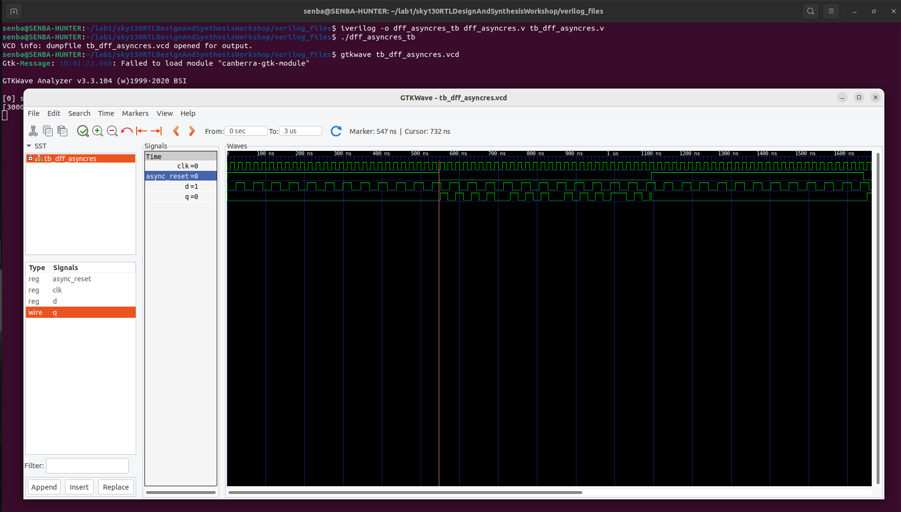
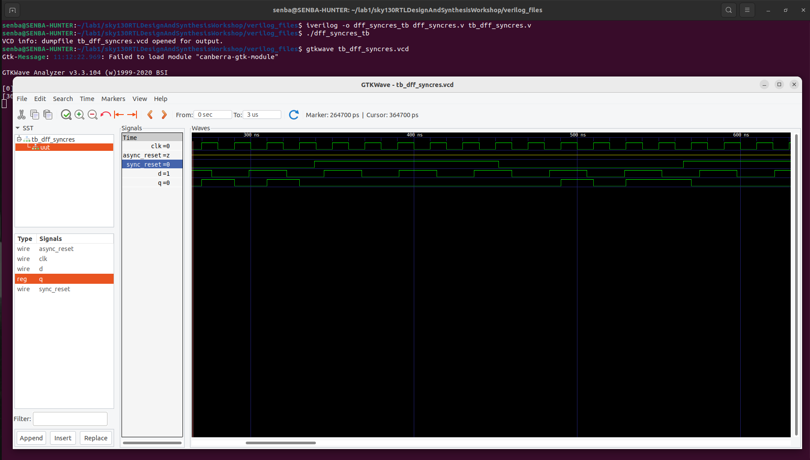
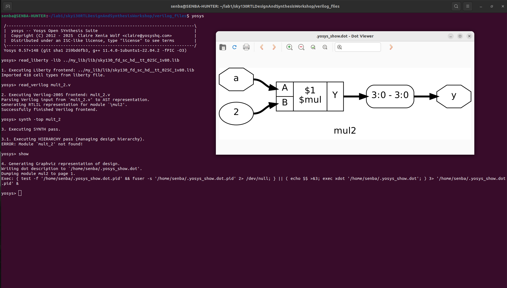
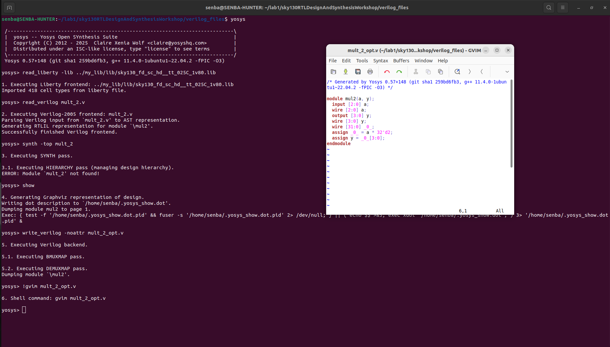

<div align="center"> # 🌟 Week 1 — Day 2 ## ⏱️ Timing Libraries · 🏗️ Hierarchical vs Flat Synthesis · 🔁 Flop Coding Styles
</div>
## Table of Contents

| **Section** | **Subtopics** |
|------------|----------------|
| [Timing Libraries .lib](#timing-libraries) | • Library Structure<br>• PVT Corners<br>• Example Library: SKY130<br>• AND Gate Flavors<br>• Liberty Snippet Comparison |
| [Hierarchical vs Flat Synthesis](#hierarchical-vs-flat-synthesis) | • Hierarchical Example Modular<br>• Flattened Synthesis<br>• Submodule Level Synthesis |
| [Flip-Flop Coding & Optimizations](#flip-flop-coding-optimizations) | • Why Flip-Flops Matter<br>• Control Pins in Flops<br>• Verilog Implementation<br>• Asynchronous vs Synchronous Reset<br>• Simulation & Synthesis Workflow |
| [Optimization in Synthesis](#optimization-in-synthesis) | • Optimization Concept<br>• Example: Mux Optimization<br>• Yosys Synthesis Workflow |

---
<a id="timing-libraries"></a>
## ⏱️ 1.Timing Libraries (.lib)

Timing libraries (`.lib`) are the **backbone of synthesis**, acting as a *dictionary* for standard cells. They define how each logic gate behaves in terms of **function**, **delay**, **power**, and **area**.

> 💡 **Why it matters**: These libraries guide synthesis tools to optimize designs for speed, power, or area based on project goals.

---

### 🔍 A. Library Structure
Each **cell** in a `.lib` file includes:
- **Logic Equation**: Defines the Boolean function (e.g., `A1 & A2` for AND gate).  
- **Pin Directions**: Specifies inputs and outputs.  
- **Timing Data**: Includes setup, hold, and propagation delays.  
- **Power Models**: Covers leakage and dynamic power consumption.  
- **Area Usage**: Represents the physical layout size.

---

### 🌡️B. PVT Corners
Silicon performance varies with **Process, Voltage, Temperature (PVT)** conditions. Key corners include:

| Corner | Voltage | Temp   | Process     | Behavior                |
|--------|---------|--------|-------------|-------------------------|
| **SS** | 1.60 V  | 125 °C | Slow-Slow   | 🐢 Worst Delay, Low Power |
| **TT** | 1.80 V  | 25 °C  | Typical     | ⚖️ Balanced             |
| **FF** | 1.95 V  | 0 °C   | Fast-Fast   | 🚀 Best Delay, High Power |

> 📌 **Pro Tip**: Always simulate across PVT corners to ensure robust designs!

---

### 📂 C. Example Library: SKY130
**Filename Breakdown**:  
`sky130_fd_sc_hd__tt_025C_1v80.lib`

| Part              | Meaning                              |
|-------------------|--------------------------------------|
| `sky130_fd_sc_hd` | SkyWater 130nm High-Density Library  |
| `tt`              | Typical Process Corner               |
| `025C`            | Temperature = 25 °C                  |
| `1v80`            | Operating Voltage = 1.80 V           |

---

### 🏗️ D. AND Gate Flavors
The **2-input AND gate** comes in multiple *drive strengths* to balance **speed**, **power**, and **area**:

| Cell Flavor | Area (µm²) | Speed       | Power Consumption | Delay      |
|-------------|------------|-------------|-------------------|------------|
| **AND2_0**  | 6.25 × 10⁸ | 🐢 Very Slow | 🔋 Very Low       | ⏱️ High     |
| **AND2_2**  | 7.50 × 10⁸ | ⚖️ Medium    | 🔋 Moderate       | ⏱️ Medium   |
| **AND2_4**  | 8.75 × 10⁸ | 🚀 Very Fast | 🔋 High          | ⚡ Very Low |

> 💡 **Design Choice**: Pick a flavor based on **timing closure** and **power budgets**.

---

### 📜 E. Liberty Snippet Comparison
Below is a comparison of `.lib` snippets for different **AND2 gate flavors** in the **SKY130** library:

| Parameter   | AND2_0 🐢         | AND2_2 ⚖️         | AND2_4 🚀         |
|-------------|-------------------|-------------------|-------------------|
| **Area**    | `6.25`            | `7.50`            | `8.75`            |
| **Function**| `(A1 & A2)`       | `(A1 & A2)`       | `(A1 & A2)`       |
| **Delay**   | ⏱️ High           | ⏱️ Medium         | ⚡ Very Low       |
| **Power**   | 🔋 Very Low       | 🔋 Moderate       | 🔋 High           |
| **Speed**   | 🐢 Very Slow      | ⚖️ Medium         | 🚀 Very Fast      |

**Liberty File Snippets**:

```liberty
cell ("sky130_fd_sc_hd__and2_0") {
  area : 6.25;
  pin(A1) { direction : input; }
  pin(A2) { direction : input; }
  pin(X)  { direction : output; function : "(A1 & A2)"; }
}

cell ("sky130_fd_sc_hd__and2_2") {
  area : 7.50;
  pin(A1) { direction : input; }
  pin(A2) { direction : input; }
  pin(X)  { direction : output; function : "(A1 & A2)"; }
}

cell ("sky130_fd_sc_hd__and2_4") {
  area : 8.75;
  pin(A1) { direction : input; }
  pin(A2) { direction : input; }
  pin(X)  { direction : output; function : "(A1 & A2)"; }
}
```
<a id="hierarchical-vs-flat-synthesis"></a>
## 🏗️ 2. Hierarchical vs Flat Synthesis

In digital design, **synthesis strategy** plays a crucial role in area, timing, and readability of the final gate-level netlist.  
Two popular approaches are **Hierarchical** (modular) and **Flat** (flattened single netlist).  

---

<div align="center">

| 🎯 Approach | 🧩 Concept | 📊 Pros | ⚠️ Cons |
|-------------|------------|---------|---------|
| **Hierarchical** | Break design into **modules** and connect in a top-level | ✔️ Easy debugging <br> ✔️ Reusable IPs <br> ✔️ Faster compile for large designs | ❌ Slightly larger area <br> ❌ Cross-module optimization limited |
| **Flat** | Collapse all modules into a **single netlist** | ✔️ Global optimization <br> ✔️ Better area & timing in some cases | ❌ Harder to debug <br> ❌ No modular reuse |

</div>

---

### A. Hierarchical Example (Modular)

```verilog
// AND Gate
module and_gate(input A, B, output Y);
    assign Y = A & B;
endmodule

// OR Gate
module or_gate(input A, B, output Y);
    assign Y = A | B;
endmodule

// Top Module
module top_hier(input X1, X2, X3, X4,
                output Y_and, Y_or);
    and_gate u1 (.A(X1), .B(X2), .Y(Y_and));
    or_gate  u2 (.A(X3), .B(X4), .Y(Y_or));
endmodule
```

📌 In this approach:  
- Each gate remains **visible** in the final netlist.  
- Debugging is easier as **boundaries** are maintained.  

<p align="center">
  
</p>

---
### Yosys Flow for Hierarchical Netlist

▶️ Start Yosys
```bash
yosys
```
📂 Load Liberty
```bash
read_liberty -lib ../my_lib/lib/sky130_fd_sc_hd__tt_025C_1v80.lib
```
📂 Load Verilog Files
```bash
read_verilog multiple_modules.v
```
⚙️ Run Synthesis
```bash
read_verilog multiple_modules.v
```
🔗 Map Cells using Liberty
```bash
abc -liberty ../my_lib/lib/sky130_fd_sc_hd__tt_025C_1v80.lib
```
👁️ Show Hierarchy Preserved
```bash
show top_module
```

<p align="center">
  
  <br>
  <em> Hierarchical Schematic (Yosys show output) </em>
</p>


## 📝 Write Netlist with Hierarchy
```bash
write_verilog -noattr multiple_modules-hier.v
```
👓 Open Netlist in GVim
```bash
!gvim multiple_modules-hier.v
```

<p align="center">
  
  <br>
  <em>Hierarchical Netlist (GVim output)</em>
</p>

### ⚙️CMOS Visualization

- **Stacked PMOS** → Not preferred, as PMOS has **poor carrier mobility**, making circuits slower.  
- **Stacked NMOS** → Generally better since NMOS has **higher mobility**, but too many in series increases resistance.  

---

<p align="center">
  
  <br>
  <em>CMOS Transistor-Level Representation</em>
</p>

### 🏗️B. Flattened Synthesis

In **flattened synthesis**, all modules in a design are merged into a **single flat netlist**, removing the original hierarchy.  
This enables **global optimizations** across the design but makes debugging more challenging.

---

### Key Points
- Command `yosys > flatten` collapses the hierarchy.  
- Sub-modules are no longer preserved after flattening.  
- The design is represented as **one unified block**.  
- Useful for **maximizing performance**, but hierarchy visibility is lost.  

---

### ✍️ Writing a Flat Netlist

1. Flatten the hierarchy
```bash
flatten
```
2. Export netlist
```bash
write_verilog -noattr good_mux_netlist_flat.v
```

3. Open with editor
```bash
!gvim good_mux_netlist_flat.v
```
<p align="center">  </p>

### 📊 Visualizing the Flat Netlist

To see the flat representation after synthesis:

```bash
yosys> flatten
```
```bash
yosys> show
```
<p align="center">  </p>

## 🔍 Hierarchical vs Flattened Synthesis

| **Aspect**            | **Hierarchical 🧩**             | **Flattened 🏗️**                |
|------------------------|---------------------------------|---------------------------------|
| **Hierarchy**          | Preserved                      | Collapsed                       |
| **Optimization Scope** | Module-level                   | Global                          |
| **Runtime**            | ⚡ Faster (scales for SoCs)     | 🐢 Slower                       |
| **Debugging**          | 🛠️ Easier                      | 🔍 Harder                       |
| **Netlist Style**      | Modular blocks                 | Single block                    |
| **Best For**           | ✅ Debug, modular development   | 🚀 Max performance optimization |

---

## 🌟 Key Takeaway

- Use **hierarchical synthesis** when you want clarity and modularity.  
- Use **flattened synthesis** when you need **maximum optimization** at the cost of runtime and debug simplicity.  

### 🧩 C. Submodule-Level Synthesis

In **submodule-level synthesis**, a single submodule of the design is synthesized independently, while the rest of the hierarchy remains untouched.  
This method is highly effective for **isolated testing, optimization, and debugging** before integrating into the top-level design.

---

### 🔹 Key Highlights
- 🎯 Focuses on **one submodule** at a time.  
- 🧩 Preserves hierarchy of other modules.  
- 📦 Ideal when **multiple instances** of the same module exist.  
- ⚡ Enables a **divide-and-conquer** approach for large designs.  
- ✅ Each submodule can be **optimized, verified, and reused** efficiently.  
- 🚫 Netlist generation at submodule stage is optional (not typically needed for final hardware).  

---

### 🖥️ Yosys Workflow

1. Launch Yosys
```bash
yosys
```

2. Load standard cell library
```bash
read_liberty -lib ../my_lib/lib/sky130_fd_sc_hd__tt_025C_1v80.lib
```

3. Load Verilog source files
```bash
read_verilog multiple_modules.v
```

4. Run synthesis only for selected submodule
```bash
synth -top sub_module1
```

5. Visualize synthesized submodule
```bash
show
```
<p align="center">  </p>

### 🌟 Why Use Submodule Synthesis?

- ✅ Speeds up **debugging** by isolating issues.  
- ✅ Saves time when working on **large SoCs**.  
- ✅ Allows **targeted optimization** of complex blocks.  
- ✅ Supports **incremental verification** at block level.  

---
<a id="flip-flop-coding-optimizations"></a>
## 🔁 3. Flip-Flop Coding Styles & Optimizations

### 🧩 A. Why Flip-Flops Matter
Flip-Flops (DFFs) are the backbone of **sequential logic circuits**.  
They serve as **data storage elements** and timing checkpoints in digital designs.

- ⏱️ **Synchronize data** across different stages of the circuit.  
- 🚫 **Prevent glitches** from propagating in combinational logic.  
- 🛑 **Isolate timing paths** to ensure stable operation.  
- 📦 Act as **building blocks** for registers, counters, and state machines.  

<p align="center">
  
</p>

---

### 🎛️ B. Control Pins in Flops
Control pins enhance the reliability of flip-flops:

- 🔄 **Reset (Rst):** Forces output to a known state (0 or 1).  
- ⚡ **Set (Set):** Forces output to the opposite known state.  
- ⏱️ **Synchronous Control:** Triggered with the clock edge.  
- ⏱️ **Asynchronous Control:** Independent of the clock.  

➡️ Correct use of control pins ensures **predictable startup and recovery behavior**.

---

### 💻 C. Verilog Implementation

#### Example 1: Positive-Edge Triggered DFF with **Asynchronous Reset**
```verilog
module dff_async_reset (
    input  wire clk,        // Clock input
    input  wire rst_n,      // Active-low asynchronous reset
    input  wire d,          // Data input
    output reg  q           // Data output
);

always @(posedge clk or negedge rst_n) begin
    if (!rst_n)
        q <= 1'b0;          // Reset output to 0
    else
        q <= d;             // Capture input on clock edge
end

endmodule
```
### Example 2: Positive-Edge Triggered DFF with Synchronous Reset
```verilog
module dff_sync_reset (
    input  wire clk,        // Clock input
    input  wire rst,        // Synchronous reset
    input  wire d,          // Data input
    output reg  q           // Data output
);

always @(posedge clk) begin
    if (rst)
        q <= 1'b0;          // Reset on clock edge
    else
        q <= d;             // Normal operation
end

endmodule
```

### ⚖️ D. Asynchronous vs Synchronous Reset

| **Aspect**            | **Asynchronous Reset** ⏱️        | **Synchronous Reset** ⚡        |
|------------------------|----------------------------------|---------------------------------|
| **Trigger**            | Independent of clock             | Only with clock edge            |
| **Response**           | Immediate                        | One cycle delay                 |
| **Usage**              | Startup circuits, critical recovery | Controlled reset inside pipelines |
| **Complexity**         | Higher (reset tree needed)       | Simpler implementation          |

---

### 🌟 Takeaway

- Use **asynchronous reset** when immediate initialization is required.  
- Use **synchronous reset** for **predictable timing** in pipelines and state machines.  
- Flip-flops are not just storage — they are **critical for timing closure, glitch removal, and stable digital design**.  

## 🔹 DFF Control Types

Flip-Flops (DFFs) can be controlled via **Reset** or **Set** signals, which come in two main types: **Asynchronous** and **Synchronous**.  
Understanding the difference is critical for reliable sequential circuit design.

---

### 🛠️ Control Type Comparison

| **Control Type**   | **Behavior** |
|--------------------|--------------|
| **Asynchronous**   | 🔄 Acts **independently of the clock**. Output responds **immediately** when the control signal is active. Ideal for **instant initialization or emergency resets**. |
| **Synchronous**    | ⏱️ Acts **in sync with the clock**. Output changes **only on the active clock edge** when the control signal is active. Ideal for **predictable timing in pipelines and registers**. |

---

### 🖼️ Visualization

<p align="center">
  
</p>

---

### 🌟 Key Points

- Asynchronous control provides **immediate response**, but can cause **timing issues** if not carefully managed.  
- Synchronous control ensures **timing predictability** and avoids race conditions in complex designs.  
- Proper selection depends on **design requirements**, e.g., startup, pipeline stability, or critical reset paths.  

---
## 🖥️ E. Simulation & Synthesis Workflow

This section demonstrates **how to simulate a DFF module** using **Icarus Verilog** and visualize waveforms with **GTKWave**.

---

1️⃣ Compile the Design

```bash
# Compile DFF module and testbench
iverilog -o dff_asyncres_tb dff_asyncres.v tb_dff_asyncres.v
```

2️⃣ Run the Simulation
```bash
# Execute the compiled simulation
./dff_asyncres_tb

```

3️⃣ View the Waveform
```bash
# Launch GTKWave to inspect the signal behavior
gtkwave tb_dff_asyncres.vcd
```
<p align="center">  </p>

### ⚡ Asynchronous Set Simulation

- When `asyn_set = 1`, the output `Q` is immediately **set to 1**.  
- This behavior is **independent of the clock**, meaning `Q` changes **instantly** without waiting for `clk`.  
- Useful for **instant initialization**, **forcing signals high**, or **control purposes** in sequential circuits.  

<p align="center">
  
</p>

---

### ⏱️ Synchronous Reset Simulation

- When `syn_res = 1`, the output `Q` is cleared to 0 **only on the active clock edge** (`clk = 1`).  
- The flip-flop **waits for the clock**, ensuring predictable timing behavior.  
- Ideal for **pipeline registers** or circuits where **timing consistency** is critical.  

<p align="center">
  
</p>

---

### 🌟 Key Takeaways

- **Asynchronous Set:** Immediate response, **clock-independent**, fast and effective for setting signals quickly.  
- **Synchronous Reset:** Clock-aligned, **predictable timing**, safer for complex sequential designs.  
- Always **simulate both behaviors** to verify correct operation of your DFF modules.

---

<a id="optimization-in-synthesis"></a>
## ⚙️ 4. Optimization in Synthesis

During synthesis, digital designs are **automatically optimized** by the synthesis tool to improve **area, speed, and power efficiency** while ensuring the circuit functions correctly.  
Optimizations can include **removing redundant logic, simplifying expressions, and reusing resources**.

---

### A. Optimization Concept

- **Goal:** Reduce **hardware complexity** and **power consumption** without altering functionality.  
- **Scope:** Can be applied at the **gate level, module level, or entire design hierarchy**.  
- **Common Techniques:**  
  - **Logic simplification:** Eliminates unnecessary gates.  
  - **Resource sharing:** Combines identical operations to save area.  
  - **Timing optimization:** Reorders logic to minimize delay.  

---

### B. Example: Mux Optimization

- Original design: `Mux-2: A[2:0] → Mux[3:0] B`  
- Observation: Some logic operations are **redundant or overlapping**.  
- **Result:** Synthesizer automatically removes unnecessary gates and simplifies the circuit.  
- Benefit: **Smaller area, lower delay, and reduced power consumption**.

## 🛠️C. Yosys Synthesis Workflow 

Follow these steps to **synthesize and visualize** a Verilog design using **Yosys**.
---

1️⃣ Start Yosys
```bash
yosys
```
2️⃣ Load Liberty Timing File
```bash
read_liberty -lib ../my_lib/lib/sky130_fd_sc_hd__tt_025C_1v80.lib
```
3️⃣ Read Verilog Design Files
```bash
read_verilog mult_2.v
```
4️⃣ Synthesize the Design
```bash
synth -top mult_2
```
5️⃣ Visualize the Synthesized Design
```bash
show

```
<p align="center">
  
</p>

6️⃣ Generate Optimized Netlist
```bash
write_verilog -noattr mult_2_opt.v
```

7️⃣ Open Netlist in gVim (Optional)
```bash
!gvim mult_2_opt.v
```

<p align="center">
  
</p>

---

### 🌟 Key Takeaways

- Optimization is **crucial for efficient hardware design**, especially for **FPGAs and ASICs**.  
- Synthesis tools can **intelligently simplify** designs while maintaining **functional correctness**.  
- Always **review synthesized netlists and reports** to understand the optimizations applied.  

# 🌟 Week 1 — Day 2 Summary

Key takeaways from **Timing Libraries, Synthesis, Flip-Flops, and Optimization**

---

## ⏱️ Timing Libraries
- Defines **function, delay, power, area** of standard cells  
- Supports **PVT corners**: SS, TT, FF  
- Example: **SKY130 AND2 gate flavors** for speed/power/area  
- Guides synthesis for **optimal design**

---

## 🏗️ Hierarchical vs Flat Synthesis
- **Hierarchical:** modules preserved, easy debugging  
- **Flat:** single netlist, global optimization  
- **Submodule synthesis:** isolates testing & optimization  
- Yosys workflow supports both hierarchical & flat approaches  

---

## 🔁 Flip-Flops
- Sequential logic **storage & timing checkpoints**  
- Control pins: **Reset & Set** (sync/async)  
- Verilog DFFs: **sync & async reset examples**  
- Simulation: **Icarus Verilog + GTKWave**  

---

## ⚙️ Optimization in Synthesis
- Reduces **area, delay, and power**  
- Techniques: **logic simplification, resource sharing, timing optimization**  
- Yosys workflow: **visualize & export optimized netlists**  
- Crucial for **FPGA & ASIC design efficiency**  

---

## 💡 Pro Tip
> Always simulate across **PVT corners**, verify **DFF behavior**, and choose the **best synthesis strategy** for your design goals.

---

## 📊 Quick Summary Table

| Section | Key Points |
|---------|------------|
| ⏱️ Timing Libraries | Function, Delay, Power, Area, PVT Corners, SKY130 Examples |
| 🏗️ Synthesis | Hierarchical vs Flat, Submodule-Level, Yosys Flow |
| 🔁 Flip-Flops | Storage, Control Pins, Sync/Async Reset, Simulation |
| ⚙️ Optimization | Area, Delay, Power, Logic Simplification, Resource Sharing |

