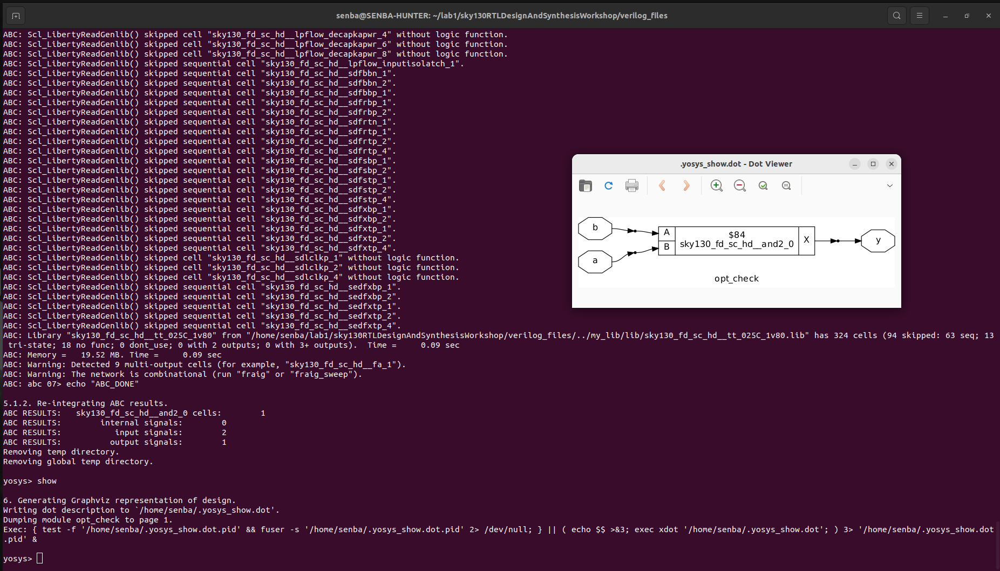

# 🌟 Day 3 — Introduction to Optimization

## 📑 Table of Contents

| No. | Main Topic | Subtopics |
|-----|------------|-----------|
| 1 | [Introduction to Optimization](#introduction-to-optimization) | Combinational & sequential optimization overview |
| 2 | [Lab – Combinational Logic Optimization](#lab--combinational-logic-optimization) | Constant propagation, Boolean logic simplification |
| 3 | [Lab – Sequential Logic Optimization](#lab--sequential-logic-optimization) | Sequential constant propagation, flip-flop optimizations |
| 4 | [Sequential Optimization – Unused Outputs](#sequential-optimization--unused-outputs) | Removing unused flip-flops, counter examples |

---

## 📝1. Introduction to Optimization  
Optimization in digital design focuses on improving the circuit for **area, power, and performance efficiency**. It can be classified into **Combinational Logic Optimization** and **Sequential Optimization**.  

---

## 🔹 Combinational Logic Optimization  
- **Constant Propagation** – Eliminating redundant constants in logic expressions.  
- **Boolean Logic Optimization** – Simplifying Boolean equations to reduce gate count.  

---

## 🔹 Sequential Optimization  

### Basic  
- **Sequential Constant Propagation** – Removing unnecessary sequential logic based on constant values.  

### Advanced  
- **State Optimization** – Reducing redundant states in FSMs.  
- **Sequential Logic Cloning** – Duplicating registers to improve timing/performance.  
- **Retiming** – Repositioning registers for better performance without changing functionality.  

---

## 📊 Classification Diagram  
  
*(Add your generated diagram in the repo and link here)*  

---

---

## 🔹 A. Constant Propagation  

Constant Propagation is an optimization technique where **constant values are substituted** into a circuit to simplify logic.  
If an input is fixed to **0 or 1**, unnecessary gates can be eliminated. This reduces **circuit size, transistor usage, and power consumption**.  

---

### 🧮 Example Circuit  

  


Equation:  

```bash
y = ¯((a · b) + c)
```
### 🔽 Reduction Steps  

Case: a = 0 (constant input) 
```bash 
y = ¯((a · b) + c)
  = ¯((0 · b) + c)
  = ¯(0 + c)
  = ¯c
  = c'
```
So, the **AND + NOR implementation** can be reduced to a **single inverter**.  

---

### ⚡ Transistor Count (Your Example)  


- **Original circuit (AND + NOR)** → **6 transistors**  
- **Optimized circuit (only inverter for c')** → **2 transistors**  

✅ **Net Reduction = 4 transistors**  

---

---

## 🔹 B. Boolean Logic Optimization

**Boolean Logic Optimization** is a technique to **simplify complex Boolean expressions** and logic circuits, which reduces:

- **Gate count**
- **Transistor usage**
- **Power consumption**
- **Delay**

The goal is to represent the same logic function in a **simpler form** using Boolean algebra or Karnaugh maps.

---

### 🧮 Example Circuit

  
Original equation:

```verilog
assign y = a ? (b ? c : (c ? a : 0)) : (!c);
```
We want to simplify this into a **reduced equation**.

---

### 🔽 Reduction Steps

**Step 1:** Analyze the nested ternary operator

```verilog
y = a ? (b ? c : (c ? a : 0)) : !c
```

**Step 2:** Consider cases

- If `a = 0` → `y = !c`  
- If `a = 1` → `y = (b ? c : (c ? 1 : 0))`  

**Step 3:** Simplify the inner expression `(b ? c : (c ? a : 0))`

- When `a = 1` → `(b ? c : (c ? 1 : 0))` → `(b AND c) OR (!b AND c)` → `c`  

**Step 4:** Combine with outer `a`

```verilog
y = a ? c : !c
```

**Step 5:** Recognize **XNOR pattern**

```verilog
y = a XNOR c
```

✅ **Final Reduced Equation:**

y = a xnor c

---

## 🔹 C. Sequential Logic Optimization

**Sequential Logic Optimization** aims to simplify circuits that include **memory elements** (like flip-flops) while preserving functionality.  

### 🔹 Sequential Constant Propagation  

This technique propagates **constant values through sequential elements** (like D flip-flops) to simplify logic. If a flip-flop output is constant, connected logic can often be reduced.

---

### 🧮 Example Circuit
  
- **Setup:**  
  - DFF with **reset active** (Q is 0 after reset)  
  - Q output of DFF → NAND gate input  
  - Another NAND input → `A`  
  - D input of DFF → grounded (`0`)  

- **Behavior:**  
  - After reset, Q = 0  
  - NAND gate output: `Y = !(Q & A) = !(0 & A) = 1` → **constant 1**  

✅ This shows that **sequential constant propagation** can reduce downstream logic because the output is always constant.

---

Sometimes, **sequential constant propagation cannot be applied** because the flip-flop output changes over time with the clock.  

### 🧮 Example Circuit
 
- **Setup:**  
  - DFF with D input → grounded (`0`)  
  - Q output → NAND gate input  
  - Another NAND input → `A`  
  - Clock drives the DFF 
  
 
- **Behavior:**  
  - On **positive edge of the clock**, Q toggles according to D input  
  - NAND gate output: `Y = !(Q & A)` → **changes between 1 and 0** over time  
  - Output is **not constant**, so **sequential constant propagation cannot be applied**  

✅ This shows that if a flip-flop output is **time-dependent**, downstream logic **cannot be reduced** using sequential constant propagation.

---

## 🔹 D. Advanced Sequential Optimization Techniques

### 1️⃣ State Optimization

**State Optimization** reduces the number of states in a finite state machine (FSM) without changing its functional behavior.  

- Minimizes the **number of flip-flops** required  
- Reduces **area, power, and complexity**  
- Often uses **state encoding techniques**  

**Example:** Reducing an FSM from 8 states to 5 states while maintaining the same outputs for all input sequences.

---

### 2️⃣ Cloning

**Cloning** duplicates parts of combinational or sequential logic to **reduce critical path delay**.  
 
- Improves **timing and throughput**  
- Reduces **fanout load** on critical signals  
- Useful in **high-speed designs**  

**Example:** Duplicating a complex combinational block feeding multiple flip-flops to avoid timing violations.

---

### 3️⃣ Retiming

**Retiming** repositions flip-flops in a sequential circuit to **improve clock frequency or reduce timing violations**.  

- Moves registers across combinational logic  
- Optimizes **critical path delays**  
- Does not change **functional behavior**  

**Example in your design:**
 
 
- Original design operated at **200 MHz**  
- After **retiming and optimizing logic delays**, the circuit now operates at **250 MHz**  

---

---

## 🧪2. Lab – Combinational Logic Optimization  

Before trying different optimization cases, let us first explore the **base Verilog design file (`opt_check.v`)**.  
This will help us understand the unoptimized logic and later compare it with optimized netlists.

---

### 🖥️ Yosys Commands

```bash
# 1. Start Yosys
yosys
```
```bash
# 2. Read Liberty timing file
read_liberty -lib ../my_lib/lib/sky130_fd_sc_hd__tt_025C_1v80.lib
```

```bash
# 3. Read Verilog design files
read_verilog opt_check.v
```

```bash
# 4. Synthesize the design
synth -top opt_check
```

```bash
# 5. Cleaning the Optimized Design
opt_clean -purge
```
```bash
# 6. Generate gate-level netlist
abc -liberty ../my_lib/lib/sky130_fd_sc_hd__tt_025C_1v80.lib
```

```bash
# 7. Visualize the synthesized design
show
```

### ⚡ A. opt_check – Constant Propagation
In this example, logic with constant inputs is simplified by the synthesis tool.

#### Example Verilog Code
verilog 
module opt_check1 (input a, output y);
  assign y = a?b:0;
endmodule

---
#### Gvim Design Code Visualization

  <p align="center">
    
  </p>

---
#### Design Visualization

  <p align="center">
    
  </p>

---
### ⚡ B. opt_check2 – Constant Propagation
---
#### Gvim Design Code Visualization

  <p align="center">
    
  </p>

---
#### Design Visualization

  <p align="center">
    
  </p>

---

### ⚡ C. opt_check3 – Constant Propagation
---
#### Gvim Design Code Visualization

  <p align="center">
    
  </p>

---
#### Design Visualization

  <p align="center">
    
  </p>

---

### ⚡ D. opt_check4 – Constant Propagation

---
#### Gvim Design Code Visualization

  <p align="center">
    
  </p>

---
#### Design Visualization

  <p align="center">
    
  </p>

---

### ⚡ E. multiple_module_opt– Constant Propagation
---
#### Gvim Design Code Visualization

  <p align="center">
    
  </p>

---
#### Design Visualization

  <p align="center">
    
  </p>

---
#### Flatten Design Visualization

  <p align="center">
    
  </p>

---

## 🧪3. Lab – Sequential Logic Optimization  

Sequential logic optimization focuses on improving circuits that include **flip-flops and memory elements**.  
Unlike combinational circuits, sequential circuits depend on both **current inputs** and **previous states**.  
Optimization here can involve **constant propagation through flip-flops**, **retiming**, or **state reduction**.  

---

### 🧩 Example: Sequential Constant Propagation  

🖥️ **Yosys Commands**

```bash
# 1. Start Yosys
yosys
```

```bash
# 2. Read Liberty timing file
read_liberty -lib ../my_lib/lib/sky130_fd_sc_hd__tt_025C_1v80.lib
```

```bash
# 3. Read Verilog design files
read_verilog dff_const1.v
```

```bash
# 4. Synthesize the design
synth -top dff_const1
```

```bash
# 5. Library Mapping for Sequential Circuits
dfflibmap -liberty ../my_lib/lib/sky130_fd_sc_hd__tt_025C_1v80.lib
```

```bash
# 6. Generate gate-level netlist
abc -liberty ../my_lib/lib/sky130_fd_sc_hd__tt_025C_1v80.lib
```

```bash
# 7. Visualize the synthesized design
show
```

### ⚡ A. dff_const1 – Sequential Constant Propagation

In this example, the **D flip-flop is forced to a constant value** after reset, so the output `q` always evaluates to a fixed logic.  
This allows Yosys to optimize away unnecessary sequential logic.

---

#### Example Verilog Code

```verilog
module dff_const1(input clk, input reset, output reg q);
  always @(posedge clk or posedge reset) begin
    if (reset)
      q <= 1'b0;
    else
      q <= 1'b1;
  end
endmodule
```
#### Code Visualization (GVim)

<p align="center">
  
</p>

---

#### Simulation Waveform Visualization

<p align="center">
  
</p>

---

#### Design Visualization (Yosys Netlist)

<p align="center">
  
</p>


### ⚡ B. dff_const2 – Sequential Constant Propagation

#### Code Visualization (GVim)

<p align="center">
  
</p>

---

#### Simulation Waveform Visualization

<p align="center">
  
</p>

---

#### Design Visualization (Yosys Netlist)

<p align="center">
  
</p>


### ⚡ C. dff_const3 – Sequential Constant Propagation


#### Code Visualization (GVim)

<p align="center">
  
</p>

---

#### Simulation Waveform Visualization

<p align="center">
  
</p>

---

#### Design Visualization (Yosys Netlist)

<p align="center">
  
</p>


### ⚡ D. dff_const4 – Sequential Constant Propagation


#### Code Visualization (GVim)

<p align="center">
  
</p>

---

#### Simulation Waveform Visualization

<p align="center">
  
</p>

---

#### Design Visualization (Yosys Netlist)

<p align="center">
  
</p>


### ⚡ E. dff_const5 – Sequential Constant Propagation

#### Code Visualization (GVim)

<p align="center">
  
</p>

---

#### Simulation Waveform Visualization

<p align="center">
  
</p>

---

#### Design Visualization (Yosys Netlist)

<p align="center">
  
</p>
---

## 4. Sequential Optimization – Unused Outputs

Sequential optimization also involves **removing unused or redundant sequential outputs** from a design.  
If only certain bits of a register are required, the synthesis tool automatically **optimizes away the unused flip-flops and logic**, reducing area and power.  

---

### ⚡ Example: Counter with Unused Outputs

In the following code, a **3-bit counter** is implemented.  
However, only the **least significant bit (`count[0]`)** is used as the output `q`.  
The higher-order bits (`count[1]` and `count[2]`) are **never used**, so Yosys will optimize them out.

#### Example Verilog Code

```verilog
module counter_opt (input clk, input reset, output q);
  reg [2:0] count;
  assign q = count[0];

  always @(posedge clk or posedge reset) begin
    if (reset)
      count <= 3'b000;
    else
      count <= count + 1;
  end
endmodule
```
### 📝 Explanation of Output

- `q` is directly connected to `count[0]`, the LSB of the counter.  
- On every positive clock edge, the counter increments, but **only the LSB is visible at the output**.  
- Since `count[1]` and `count[2]` are unused, Yosys removes the unnecessary flip-flops during optimization.  
- ✅ Result: The **optimized circuit contains only 1 flip-flop** (for `count[0]`) instead of 3.  

---

### 🖥️ Yosys Commands

```bash
# 1. Start Yosys
yosys
```
```bash
# 2. Read Liberty timing file
read_liberty -lib ../my_lib/lib/sky130_fd_sc_hd__tt_025C_1v80.lib
```

```bash
# 3. Read Verilog design files
read_verilog counter_opt.v
```

```bash
# 4. Synthesize the design
synth -top counter_opt
```

```bash
# dff calling 
dfflibmap -liberty ../my_lib/lib/sky130_fd_sc_hd__tt_025C_1v80.lib
```
```bash
# 6. Generate gate-level netlist
abc -liberty ../my_lib/lib/sky130_fd_sc_hd__tt_025C_1v80.lib
```

```bash
# 7. Visualize the synthesized design
show
```
#### Code Visualization (GVim)

<p align="center">
  
</p>

---

#### Design Visualization (Yosys Netlist)

<p align="center">
  
</p>


### ⚡ Example: Counter with All Outputs Used (counter_opt2.v)

In this updated example, the same **3-bit counter** is implemented, but now **all the flip-flops are functionally required**.  
This prevents Yosys from optimizing out unused logic.

#### Example Verilog Code

```verilog
module counter_opt2 (input clk, input reset, output [2:0] q);
  reg [2:0] count;
  assign q = count;

  always @(posedge clk or posedge reset) begin
    if (reset)
      count <= 3'b000;
    else
      count <= count + 1;
  end
endmodule
```

## 📝 Explanation of Output

Unlike the previous version, here the entire 3-bit vector `count` is mapped to the output `q`.

This means:

- **q[0]** → toggles at every clock edge (fastest).  
- **q[1]** → toggles every 2 cycles.  
- **q[2]** → toggles every 4 cycles.  

Since all bits of the counter are used, **Yosys cannot remove any flip-flops**.

✅ **Result**: The final synthesized design keeps all 3 flip-flops.

---

### Code Visualization (GVim)

<p align="center"> 
   
</p>

---

### Design Visualization (Yosys Netlist)

<p align="center"> 
   
</p>


