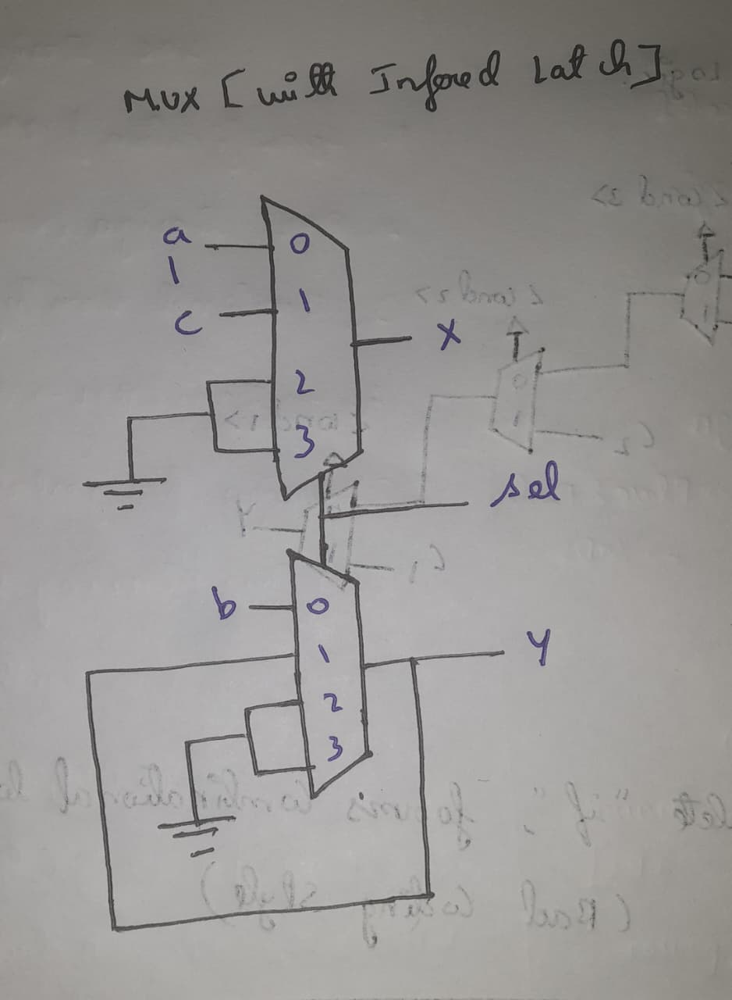

<div align="center">
  <h1>🚀 Day 5 — Control Constructs & Looping in Verilog</h1>
  <p>
    In <b>Day 5</b>, we dive into <b>decision-making constructs</b>  
    (`if-else`, `case`) and <b>looping mechanisms</b> (`for`, `generate`).  
    We also study how incomplete constructs lead to <b>latch inference</b>  
    and how loops enable <b>scalable hardware design</b>.
  </p>

  
  
  
  
</div>

---
# 📑 Table of Contents — Day 5

| Section | Subheadings |
|---------|-------------|
| [1️⃣ Conditional Constructs in Verilog](#1-conditional-constructs-in-verilog) | - Priority Logic (`if-else if-else`) <br> - Incomplete `if` Statements <br> - Sequential Logic Usage |
| [2️⃣ The case Statement in Verilog](#2-the-case-statement-in-verilog) | - Basic Case Implementation <br> - Common Pitfalls <br> - Overlapping Cases |
| [3️⃣ Labs on Incomplete If-Case](#3-labs-on-incomplete-if-case) | - incomp_if <br> - incomp_if2 |
| [4️⃣ Labs on Incomplete and Overlapping Case Statements](#4-labs-on-incomplete-and-overlapping-case-statements) | - incomp_case <br> - comp_case <br> - bad_case <br> - partial_case_assign |
| [5️⃣ Loops in Verilog: Procedural & Generate](#5-loops-in-verilog-procedural-and-generate) | - Procedural `for` Loop <br> - generate `for` Loop <br> - Comparison Table |
| [6️⃣ Labs on `for` Loop & `for-generate` Constructs](#6-labs-on-for-loop-and-for-generate-constructs) | - MUX Using Procedural `for` <br> - DEMUX Using Case <br> - DEMUX Using Procedural `for` <br> - 8-bit Ripple Carry Adder |
| [🌟 Day 5 Summary: Conditional & Loop Constructs in Verilog](#day-5-summary-conditional-and-loop-constructs-in-verilog) | - Key Takeaways <br> - Best Practices <br> - Labs Observations |


### 1 Conditional Constructs in Verilog


Conditional logic is at the heart of hardware design in Verilog. Designers use **`if` and `case` statements** to express **decision-making behavior**. These constructs are directly synthesized into hardware, so **how you write them impacts the resulting circuit**.  

⚡ **Key Points:**
- Conditional constructs are used in **combinational** and **sequential** logic.  
- Incorrect or incomplete usage can lead to **inferred latches**, **unexpected hardware**, or **inefficient circuits**.  
- Always understand **synthesis implications** when writing conditionals.

---

## 🔹 1) The `if` Statement in Verilog

The `if` statement is a primary construct for **decision-making** and **priority-based logic**.

### A) Priority Logic Implementation
- An `if-else if-else` chain synthesizes into **priority logic**.  
- Hardware equivalent: **chain of multiplexers**, where the first true condition determines the output.

```verilog
begin
    if (<cond_1>)
        // Action 1
    else if (<cond_2>)
        // Action 2
    else if (<cond_3>)
        // Action 3
    else
        // Default Action
end
```
<p align="center">  </p>

## Execution Flow:

- <cond_1> → highest priority.

- If false, <cond_2> is checked, then <cond_3>, and finally the else block.

### B) Incomplete if Statements – Danger in Combinational Logic

-  Missing a final else can cause **inferred latches.**

-  **Reason**: The synthesis tool must “hold” the previous value when no condition is true.

-  ❌ Bad Practice: Using incomplete if in combinational blocks.

<p align="center">  </p> <p align="center">  </p>


## C) Valid Usage in Sequential Logic

In **sequential circuits**, incomplete if statements are **intentional**, e.g., counters
```verilog
always @(posedge clk or posedge rst) begin
    if (rst)
        count <= 0;
    else if (en)
        count <= count + 1;
    // No final else: holds previous value
end
```
<p align="center">  </p>

### 2 The case Statement in Verilog

The `case` statement provides a **structured way** to select between multiple options based on a **selector signal**.

#### A) Basic Implementation
- Synthesizes into a **multiplexer**, driven by the selector.  
- Easier to read and maintain than multiple `if-else` statements.

```verilog
module mux4x1_case (
    input  [1:0] sel,    // 2-bit selector
    input  C1, C2, C3, C4, // 4 data inputs
    output reg y         // output
);

always @(*) begin
    case (sel)
        2'b00: y = C1;
        2'b01: y = C2;
        2'b10: y = C3;
        2'b11: y = C4;
        default: y = 0;   // safe default to avoid latch inference
    endcase
end

endmodule
```
<p align="center">  </p>

### B) Common Pitfalls & Solutions for `case`

#### 1) Incomplete Case
- ❌ Missing cases cause **latches to be inferred**.
- ✅ Fix: Always include a `default` branch.

```verilog
case (sel)
    2'b00: y = C1;
    2'b01: y = C2;
    default: y = 0;  // prevents latch inference
endcase
```
<p align="center">  </p> 

### C) Overlapping Cases

- Unlike `if-else`, `case` statements **do not have priority**.  
- ❌ Overlapping selectors lead to ambiguity.

```verilog
always @(*) begin
    case (sel)
        2'b00: y = a;
        2'b01: y = b;
        2'b10: y = c;
        2'b10: y = d;  // ❌ Overlapping selector
        default: y = 0;
    endcase
end
```

**Summary:**

- ✅ `if-else` → **priority logic**
- ✅ `case` → **multiplexer selection**
- ⚠️ Always handle **incomplete and overlapping cases** to prevent unintended hardware

<p align="center">
  
</p>

### 3 Labs on Incomplete If-Case 

In this lab, we explore **how incomplete `if` statements** can lead to **inferred latches** in combinational logic.  
We'll simulate the designs using **Icarus Verilog + GTKWave** and observe synthesized hardware using **Yosys**.

---

### ⛏️ Commands Overview  

- **Simulate RTL:** `iverilog <module.v> <testbench.v>` → `./a.out`  
- **View Waveform:** `gtkwave <wavefile.vcd>`  
- **Synthesize & Analyze:** `yosys` commands (`read_verilog`, `synth`, `abc`, `show`)  

---

### 🔹 A — `incomp_if` (Incomplete `if` → inferred latch)

#### Design Code
```verilog
module incomp_if (
    input i0, input i1, input i2,
    output reg y
);
always @(*) begin
    if(i0)
        y <= i1;
end
endmodule
```
## Simulation with Icarus Verilog

```bash
# Compile and run RTL + testbench
iverilog incomp_if.v tb_incomp_if.v
./a.out
gtkwave tb_incomp_if.vcd
```
<p align="center">  </p>

### Observation:

-  Since there is no final else, a latch is inferred to hold the previous value when i0 = 0.

-  This is undesirable in combinational logic.

## Synthesis with Yosys

```yosys
read_liberty -lib ../my_lib/lib/sky130_fd_sc_hd__tt_025C_1v80.lib
read_verilog incomp_if.v
synth -top incomp_if
abc -liberty ../my_lib/lib/sky130_fd_sc_hd__tt_025C_1v80.lib
show
```
</p> <p align="center">  </p>

✅ Observation: The synthesized netlist clearly shows an inferred D-latch, caused by incomplete conditional logic.


## 🔹 B — incomp_if2 (Incomplete if-else if → inferred latch)

## Design Code
```verilog
module incomp_if2 (
    input i0, i1, i2, i3,
    output reg y
);
always @(*) begin
    if(i0)
        y <= i1;
    else if (i2)
        y <= i3;
    // No final else → inferred latch
end
endmodule
```

## Simulation with Icarus Verilog
```bash
iverilog incomp_if2.v tb_incomp_if2.v
./a.out
gtkwave tb_incomp_if2.vcd
```
<p align="center">  </p>

## Synthesis with Yosys
```yosys
read_liberty -lib ../my_lib/lib/sky130_fd_sc_hd__tt_025C_1v80.lib
read_verilog incomp_if2.v
synth -top incomp_if2
abc -liberty ../my_lib/lib/sky130_fd_sc_hd__tt_025C_1v80.lib
show
```
<p align="center"> 

  ⚡ Observation: Even with multiple conditions (if-else if), the absence of a final else causes synthesis to infer a latch, highlighting a common pitfall in combinational logic design.


### 4 Labs on Incomplete and Overlapping Case Statements  

In this lab, we explore how **incomplete, overlapping, or partially assigned case statements** can affect **hardware synthesis** in Verilog.  
We'll simulate the designs using **Icarus Verilog + GTKWave** and synthesize using **Yosys** to observe inferred latches and hardware mapping.

---

### 🔹 A — `incomp_case` [Incomplete Case]

#### Design Code
```bash
module incomp_case (input i0 , input i1 , input i2 , input [1:0] sel, output reg y);
always @ (*)
begin
	case(sel)
		2'b00 : y = i0;
		2'b01 : y = i1;
	endcase
end
endmodule
```

## RTL Simulation with Icarus Verilog
```bash
# Compile RTL + testbench
iverilog incomp_case.v tb_incomp_case.v
./a.out
gtkwave tb_incom_case.vcd
```
<p align="center">  </p>

## Yosys Synthesis
```yosys
read_liberty -lib ../my_lib/lib/sky130_fd_sc_hd__tt_025C_1v80.lib
read_verilog incomp_case.v
synth -top incomp_case
abc -liberty ../my_lib/lib/sky130_fd_sc_hd__tt_025C_1v80.lib
show 
```
<p align="center">  </p>

⚠️ Observation: **Incomplete case statements** can lead to **inferred latches**, as unhandled selector values are stored in memory.

## 🔹 B — comp_case [Complete Case]

## Design Code
  ```verilog
  module comp_case (input i0 , input i1 , input i2 , input [1:0] sel, output reg y);
always @ (*)
begin
	case(sel)
		2'b00 : y = i0;
		2'b01 : y = i1;
		default : y = i2;
	endcase
end
endmodule
```
## RTL Simulation with Icarus Verilog
```bash
iverilog comp_case.v tb_comp_case.v
./a.out
gtkwave tb_comp_case.vcd
```
<p align="center">  </p>

## Yosys Synthesis
```yosys
read_liberty -lib ../my_lib/lib/sky130_fd_sc_hd__tt_025C_1v80.lib
read_verilog comp_case.v
synth -top comp_case
abc -liberty ../my_lib/lib/sky130_fd_sc_hd__tt_025C_1v80.lib
show 
```
<p align="center">  </p>

✅ Observation: Adding a default branch handles all remaining selector values and prevents latch inference.

## 🔹 C — bad_case [Ambiguous / Overlapping Case]
## Design Code
```verilog
module bad_case (input i0 , input i1, input i2, input i3 , input [1:0] sel, output reg y);
always @(*)
begin
	case(sel)
		2'b00: y = i0;
		2'b01: y = i1;
		2'b10: y = i2;
		2'b1?: y = i3;
	endcase
end

endmodule
```
## RTL Simulation with Icarus Verilog
```bash
iverilog bad_case.v tb_bad_case.v
./a.out
gtkwave tb_bad_case.vcd
```
<p align="center">  </p>

## Yosys Synthesis
```yosys
read_liberty -lib ../my_lib/lib/sky130_fd_sc_hd__tt_025C_1v80.lib
read_verilog bad_case.v
synth -top bad_case
abc -liberty ../my_lib/lib/sky130_fd_sc_hd__tt_025C_1v80.lib
show 
```
<p align="center">  </p>

⚠️ Observation: Overlapping or wildcard cases can create ambiguous hardware logic, leading to unpredictable behavior.

## 🔹 D — partial_case_assign [Partial Case Assignment]
## Design Code
```verilog
module partial_case_assign (input i0 , input i1 , input i2 , input [1:0] sel, output reg y , output reg x);
always @ (*)
begin
	case(sel)
		2'b00 : begin
			y = i0;
			x = i2;
			end
		2'b01 : y = i1;
		default : begin
		           x = i1;
			   y = i2;
			  end
	endcase
end
endmodule
```

## Yosys Synthesis
```yosys
read_liberty -lib ../my_lib/lib/sky130_fd_sc_hd__tt_025C_1v80.lib
read_verilog partial_case_assign.v
synth -top partial_case_assign
abc -liberty ../my_lib/lib/sky130_fd_sc_hd__tt_025C_1v80.lib
show 
```
<p align="center">  </p>

⚠️ Observation: Partial assignments can also infer latches. Always assign all outputs in every case branch to ensure deterministic behavior.


### 5 Loops in Verilog Procedural and Generate
Loops are essential in **hardware design** for describing both **behavioral logic** and **structural replication**.  
Verilog supports two primary looping constructs:

---

### 1️⃣ Procedural `for` Loop (Behavioral)

**Key Points:**  
- Used **inside `always` blocks**.  
- Describes **behavioral logic**, not direct hardware replication.  
- Ideal for **iterative assignments**, **MUX/DEMUX logic**, or **bit-wise operations**.

#### 🔹 Example: 32×1 Multiplexer using Procedural `for`
```verilog
module mux32x1 (
    input  wire [31:0] inp,
    input  wire [4:0]  sel,
    output reg         Y
);
integer i;
always @(*) begin
    Y = 0;
    for (i = 0; i < 32; i = i + 1) begin
        if (sel == i)
            Y = inp[i];
    end
end
endmodule
```
💡 Note: Here, the for loop **evaluates conditions sequentially** at runtime, and synthesizes into a priority multiplexer chain.

### 2️⃣ generate for Loop (Structural / Hardware Replication)

**Key Points:**

-  Used outside always blocks.

-  Generates multiple hardware instances in a structured way.

-  Useful for arrays of gates, adders, or replicated modules.

## 🔹 Example 1: Array of AND Gates
```verilog
module and_array #(parameter N=4)(
    input  wire [N-1:0] A, B,
    output wire [N-1:0] Y
);
genvar i;
generate
    for (i = 0; i < N; i = i + 1) begin : AND_LOOP
        and g (Y[i], A[i], B[i]);
    end
endgenerate
endmodule
```
## 🔹 Example 2: N-bit Ripple Carry Adder
``` verilog
module rca #(parameter N=4)(
    input  wire [N-1:0] A, B,
    input  wire Cin,
    output wire [N-1:0] Sum,
    output wire Cout
);
wire [N:0] c;
assign c[0] = Cin;
assign Cout = c[N];

genvar i;
generate
    for (i = 0; i < N; i = i + 1) begin : RCA_LOOP
        full_adder FA (
            .a(A[i]), .b(B[i]), .cin(c[i]),
            .sum(Sum[i]), .cout(c[i+1])
        );
    end
endgenerate
endmodule
```
💡 Note: generate for **creates multiple instances at compile time**, producing replicated hardware blocks efficiently.

### 📊 Procedural `for` vs `generate for` Loops in Verilog

| **Feature**               | **Procedural `for` Loop**              | **`generate for` Loop**                  |
|----------------------------|----------------------------------------|-----------------------------------------|
| **Placement**              | Inside an `always` block               | Outside an `always` block               |
| **Purpose**                | Evaluate expressions / describe logic behavior | Instantiate / replicate hardware blocks |
| **Synthesis Concept**      | Behavioral logic (e.g., priority MUX) | Structural replication of modules or gates |
| **Execution / Runtime**    | Sequential evaluation during simulation | Compile-time hardware generation        |
| **Use Case**               | Iterative assignments, MUX selection   | Arrays of gates, adders, repeated modules |


### 6 Labs on for Loop and for-generate Constructs  

In this lab, we explore **iterative Verilog constructs** that enable both **behavioral** and **structural hardware modeling**.  
We will implement, simulate, and analyze different designs using **procedural `for` loops** (inside `always` blocks) and **`for-generate` loops** (for structural replication).

---

## 1. MUX Using Procedural `for` Loop  

### A)  Design Code  
```verilog
module mux_generate (
    input  i0, i1, i2, i3,
    input  [1:0] sel,
    output reg y
);
wire [3:0] inputs;
assign inputs = {i3, i2, i1, i0};
integer k;

always @(*) begin
    for (k = 0; k < 4; k = k + 1) begin
        if (sel == k)
            y = inputs[k];
    end
end
endmodule
```

## Explanation:
This 4×1 MUX uses a **procedural** for **loop** to iterate through all input lines and assign the selected input to the output. It demonstrates **behavioral modeling** of selection logic using iterative constructs.

## B)  GTKwave Simulation Waveform
<p align="center">  </p> 

## 2. DEMUX Using Case Statement
## A)  Design Code
```verilog
module demux_case (
    output o0, o1, o2, o3, o4, o5, o6, o7,
    input [2:0] sel,
    input i
);
reg [7:0] y_int;
assign {o7,o6,o5,o4,o3,o2,o1,o0} = y_int;

always @(*) begin
    y_int = 8'b0;
    case (sel)
        3'b000: y_int[0] = i;
        3'b001: y_int[1] = i;
        3'b010: y_int[2] = i;
        3'b011: y_int[3] = i;
        3'b100: y_int[4] = i;
        3'b101: y_int[5] = i;
        3'b110: y_int[6] = i;
        3'b111: y_int[7] = i;
    endcase
end
endmodule
```

## Explanation:
This DEMUX uses a **case statement** to assign a single input to one of eight outputs based on the select signal. It highlights **behavioral control flow** without structural replication.

## B)  GTKwave Simulation Waveform
<p align="center">  </p>


## 3. DEMUX Using for-generate
## A)  Design Code
```verilog
module demux_generate (
    output o0, o1, o2, o3, o4, o5, o6, o7,
    input [2:0] sel,
    input i
);
reg [7:0] y_int;
assign {o7,o6,o5,o4,o3,o2,o1,o0} = y_int;
integer k;

always @(*) begin
    y_int = 8'b0;
    for (k = 0; k < 8; k = k + 1) begin
        if (k == sel)
            y_int[k] = i;
    end
end
endmodule
```
## Explanation:
Here, the DEMUX logic is implemented using a for **loop** for procedural iteration. This approach structurally resembles replication of logic per output line and is scalable for larger buses.

## B)  GTKwave Simulation Waveform
<p align="center">  </p>

## 4️. 8-bit Ripple Carry Adder (RCA) Using for-generate
## A) 📜 Design Code
```verilog
module rca (
    input  [7:0] num1,
    input  [7:0] num2,
    output [8:0] sum
);
wire [7:0] int_sum;
wire [7:0] int_co;

genvar i;

// Instantiate 7 full adders using for-generate
generate
    for (i = 1; i < 8; i = i + 1) begin : RCA_LOOP
        fa u_fa (.a(num1[i]), .b(num2[i]), .c(int_co[i-1]),
                 .sum(int_sum[i]), .co(int_co[i]));
    end
endgenerate

// First full adder
fa u_fa0 (.a(num1[0]), .b(num2[0]), .c(1'b0), .sum(int_sum[0]), .co(int_co[0]));

assign sum[7:0] = int_sum;
assign sum[8] = int_co[7];
endmodule
```

## Explanation:
This RCA is implemented by **structurally instantiating multiple full-adder modules** using a for-generate loop. Each adder connects carry-out to the next stage’s carry-in, demonstrating **scalable structural design.**

## B) GTKwave Simulation Waveform
<p align="center">  </p>


### Day 5 Summary Conditional and Loop Constructs in Verilog

Day 5 focused on **decision-making constructs** (`if`, `case`) and **iterative constructs** (`for` loops and `for-generate`) in Verilog. These constructs are essential for writing **predictable, synthesizable hardware designs**.  

---

## 1️⃣ Conditional Constructs

### 🔹 `if-else` Statements
- **Priority Logic:** `if-else if-else` chains are synthesized as **priority multiplexers**.
- **Incomplete `if` in Combinational Logic:** May cause **inferred latches**, holding previous values unintentionally.
- **Sequential Logic Exception:** Incomplete `if` statements in sequential logic are valid for holding state.

### 🔹 `case` Statements
- **Multiplexer Representation:** `case` statements synthesize as **selector-driven multiplexers**.
- **Incomplete `case`:** May infer latches if not all selector values are covered.
- **Partial Assignment & Overlapping Cases:** Ensure **all outputs are assigned in all branches**; avoid duplicate selectors.

**Key Takeaways:**  
- Always include `else` or `default` to prevent latch inference in combinational logic.  
- Be cautious with overlapping `case` items—unlike `if-else`, `case` has no inherent priority.

---

## 2️⃣ Loop Constructs

### 🔹 Procedural `for` Loop (inside `always`)
- **Behavioral Logic Modeling:** Evaluates expressions and drives outputs iteratively.  
- **Use Cases:** MUX/DEMUX selection, iterative assignments.  

### 🔹 `for-generate` Loop (outside `always`)
- **Structural Hardware Modeling:** Instantiates multiple hardware blocks systematically.  
- **Use Cases:** Arrays of gates, replicated modules, scalable arithmetic units like RCA.

**Key Takeaways:**  
- Procedural `for` loops **do not instantiate hardware**, they control **behavioral evaluation**.  
- `for-generate` loops **physically replicate hardware**, ideal for scalable design patterns.

---

## 3️⃣ Labs & Experiments

| Lab | Focus | Observations |
|-----|-------|-------------|
| `incomp_if` / `incomp_if2` | Incomplete `if` → inferred latches | Latches inferred in combinational logic; sequential logic safe |
| `incomp_case` / `comp_case` / `bad_case` | Case statements | Missing default or overlapping items cause latch or ambiguous behavior |
| `partial_case_assign` | Partial assignments in `case` | Always assign all outputs in all branches to avoid latches |
| `mux_generate` | Procedural `for` | Behavioral modeling of MUX using iterative assignments |
| `demux_case` / `demux_generate` | DEMUX implementations | Case-based vs iterative procedural modeling demonstrated |
| `rca` | Ripple Carry Adder using `for-generate` | Structural replication of full-adders; scalable arithmetic design |

---

## ✅ Summary of Best Practices

1. **Combinational Logic**
   - Always include `else` (if) or `default` (case) to prevent inferred latches.  
   - Assign all outputs in all branches.

2. **Sequential Logic**
   - Incomplete `if` statements are valid to hold state.

3. **Loops**
   - Use **procedural `for`** for iterative behavioral evaluation.  
   - Use **`for-generate`** for structural replication and scalable hardware instantiation.

4. **Synthesis Awareness**
   - Know how constructs map to hardware: `if-else` → priority MUX, `case` → selector-driven MUX.  
   - Always simulate RTL and verify in GTKWave before synthesis.

---

**Day 5 Outcome:**  
- Mastery of conditional and loop constructs in Verilog.  
- Awareness of **latch inference issues**, and methods to **avoid unintended hardware behavior**.  
- Hands-on practice with **MUX/DEMUX design, partial assignments, and RCA implementation**.  
- Prepared to use loops and conditional statements in **both behavioral and structural Verilog** effectively.

<p align="center">
  
</p>


